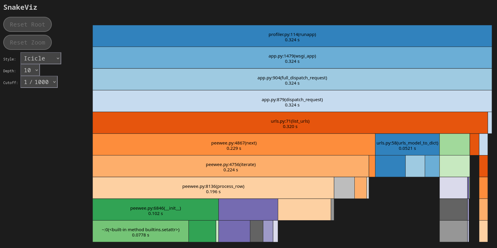
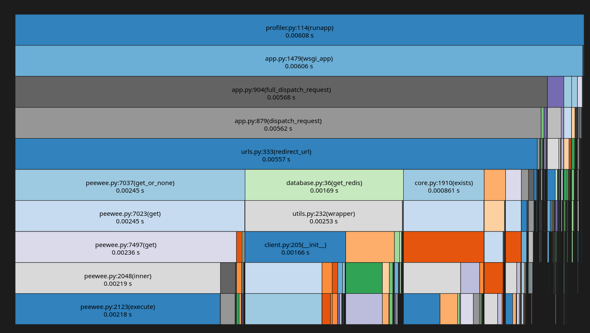
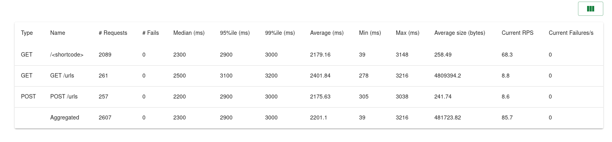
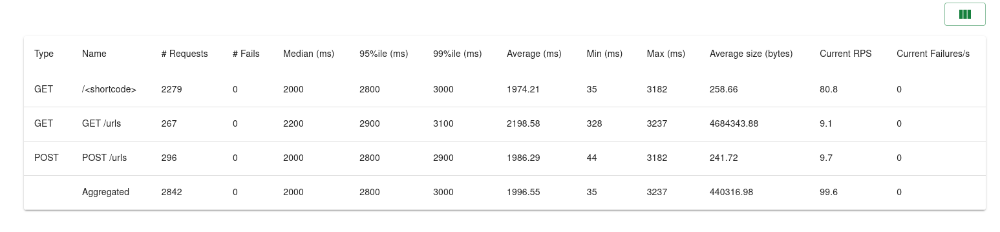
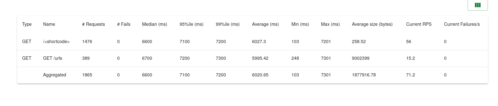
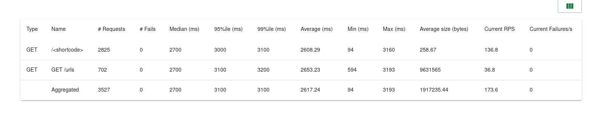

# Bottleneck Report

## The Database
The database is by far the biggest bottleneck. 
The slowest endpoint included in the traffic tests is "/urls". When there isn't a cached response, the flamegraph looks like this:

As you can see, accessing the database takes up the majority of the time.

This is also true of the hotpath, visiting a shortened url, though it's fast enough that it doesn't make much of a difference.

### pgbouncer
PostgreSQL is known to struggle with large volumes of connections. So, we added pgbouncer, a connection pool for PostgreSQL which handles the large volumes of connections and feeds them into a smaller set of long lasting PostgreSQL connections. As you can see from the before and after, it made a notable difference, though it definitely doesn't solve the database bottleneck.

Before:

After:

### Caching with Redis
As stated above, the database heavy endpoints like `/urls` are by far the slowest. Caching makes them much, much faster.

Before:

After:

But caching has a major limitation: Users want to see the latest data at all time. So whenever a user changes a URL the cache has to be invalidated. Caching is still impactful, but it's impact is greatly reduced compared to workloads where users never change the data.

## The Server
Another bottleneck is Flask. As a WSGI framework, each worker can only work on one request at a time. So while an individual request only takes a few milliseconds, once the requests start queueing up it starts to take seconds from when a request is received to when a request is processed. This is especially bad with big database requests, as the server is idling waiting for the database.

The solution is simple: More workers, and more instances. More workers means more requests can be completed in parallel which means they get completed faster.

### Other tricks
Other than just increasing compute, we use a few sneaky tricks to help improve performance. 

Gunicorn, our web server, does not work asynchronously. However, you can use `gevent` runners, which makes each worker have an asynchronous event loop. This lets the worker start to work on the next request while Flask is accessing I/O and making web requests. In our case, calls to Redis are web requests that give the runner time to start working on other things.

